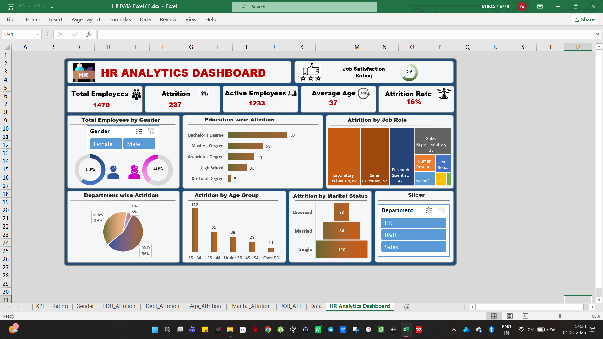

# HR-Analytics-Dashboard

## Tools Used
- Microsoft Excel
- Pivot Tables
- Pivot Charts
- Slicers
- Conditional formatting

## Key Insights
- R&D departement has the highest attrition.
- Employees aged 25-34 shows the highest attrition.
- Single Employees have higher attrition than married Employees.
- Bachelor's degree holders contribute the largest share of attrition.

## Dashboard Screenshot

